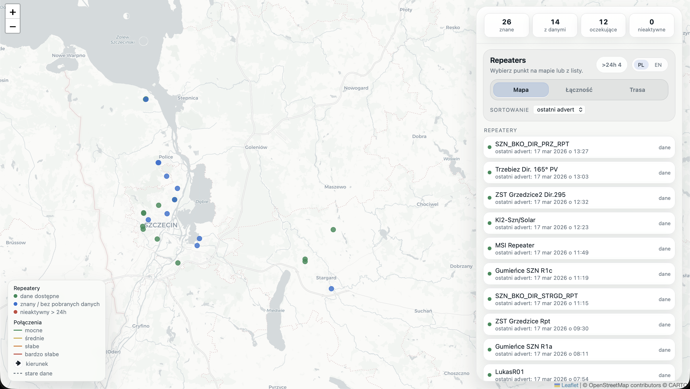
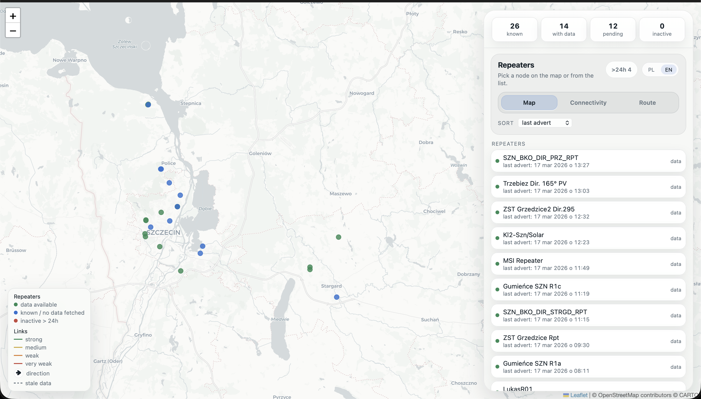
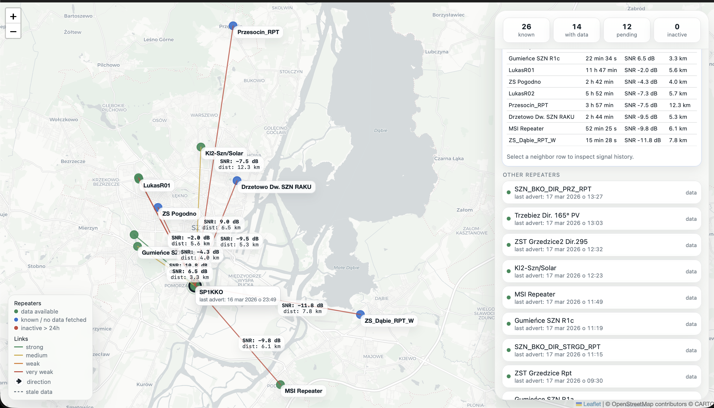
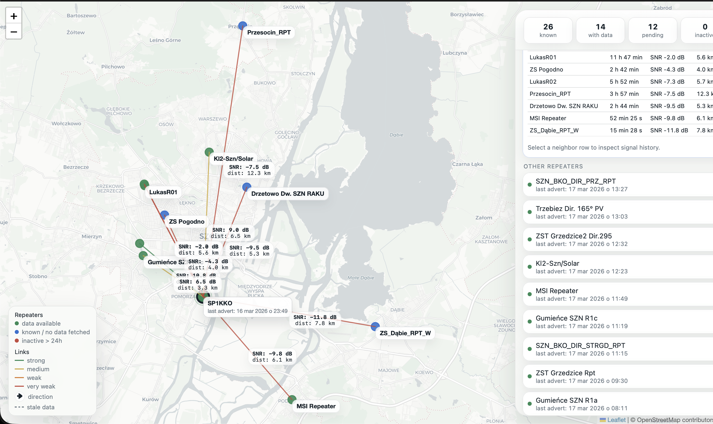
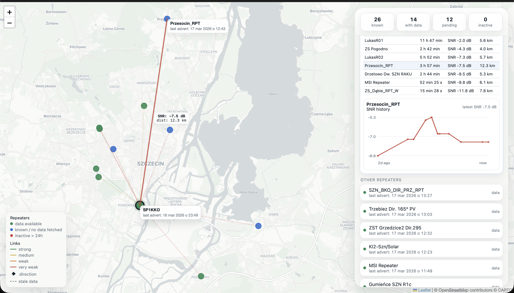
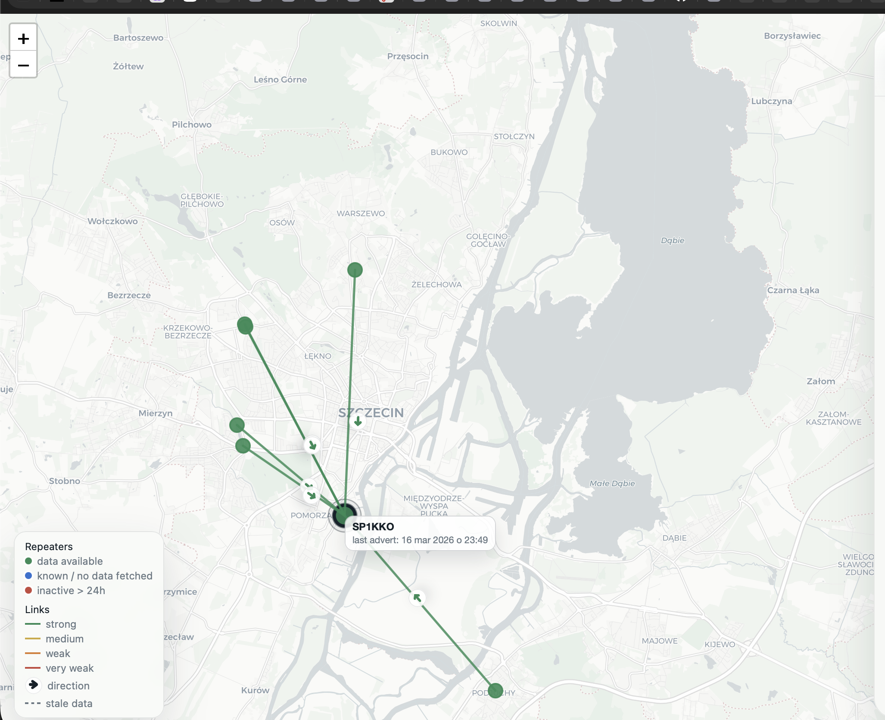
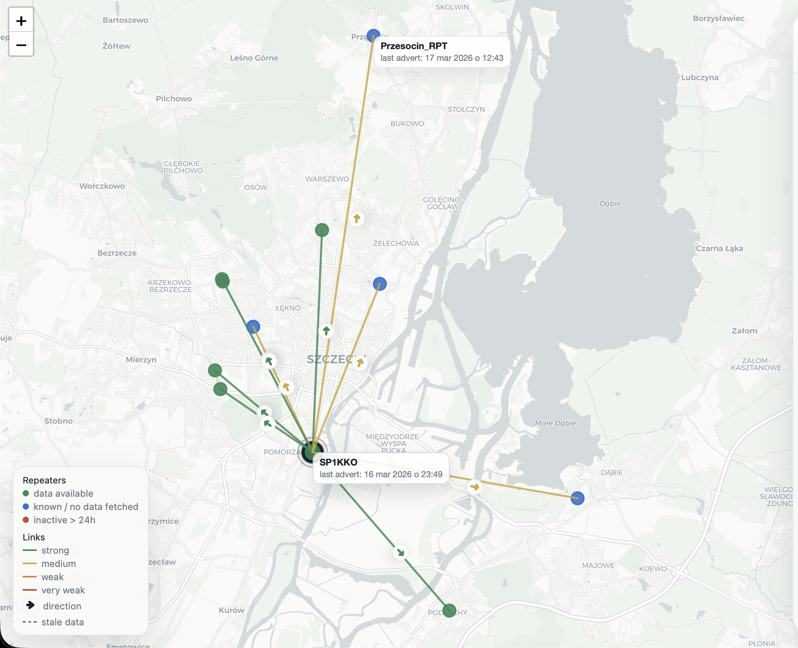
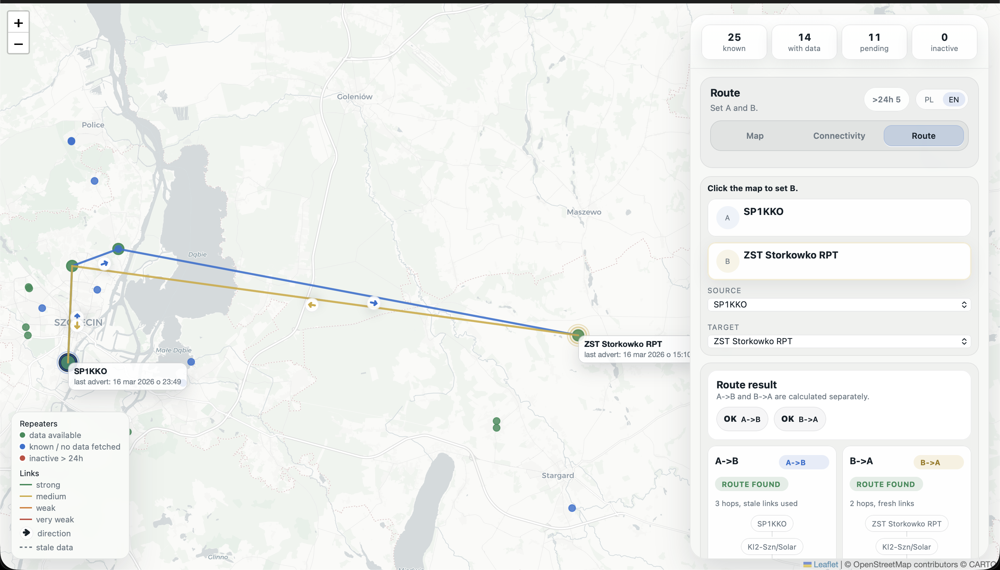

# MeshCore Connectivity Console

MeshCore Connectivity Console is a MeshCore operations stack built around serial-over-TCP. It collects adverts, probes repeaters, stores neighbour history in SQLite, serves a web dashboard, and exposes a CLI for inspection and maintenance.

It is built for setups that already expose MeshCore through [meshcore-xiao-wifi-serial2tcp](https://github.com/zm0ra/meshcore-xiao-wifi-serial2tcp) or a compatible RS232 bridge.

## Screenshots

### Dashboard overview



Main inventory view with access to the map, connectivity, and route analysis screens.

### Connectivity inspection



Neighbour list and relation details for the selected repeater.



Signal history for a selected link.



Outbound-focused map view showing what one repeater currently sees.



Comparison view for one-way and mutual relations.

### Mobile views



Compact map-first mobile layout.



Connectivity view adapted for smaller screens.

### Route analysis



Directional route analysis where `A -> B` and `B -> A` are shown separately.

## What it does

- opens TCP sessions to RS232 bridge endpoints
- ingests MeshCore adverts and stores repeater metadata
- probes reachable repeaters and saves neighbour snapshots
- builds a directed connectivity model from the latest saved data
- serves a desktop and mobile web UI
- runs a small hashtag-channel bot on the same transport layer

## How it is wired

The runtime uses three transport paths:

- `5002` for the primary RS232 bridge traffic
- `5001` for direct console access when available
- `5003` for an optional console mirror

`5002` stays the primary packet path. The console mirror is auxiliary.

The Compose stack starts these services:

- `init-db`
- `ensure-identity`
- `bridge-gateway`
- `neighbours-worker`
- `bot-worker`
- `web`

SQLite is stored in the shared data volume. There is no separate database container.

## Quick start

```bash
cp config/config.example.toml config/config.toml
cp docker-compose.example.yml docker-compose.yml
docker compose up -d --build
```

Logs:

```bash
docker compose logs --tail 100 bridge-gateway neighbours-worker bot-worker web
```

The web UI listens on `8080` by default.

## Configuration

The example config lives in [config/config.example.toml](config/config.example.toml).

The important sections are:

- `[service]`
- `[storage]`
- `[identity]`
- `[probe]`
- `[bot]`
- `[web]`
- `[gateway]`
- `[[endpoints]]`

Example endpoint:

```toml
[[endpoints]]
name = "RPT_WEST"
raw_host = "192.0.2.10"
raw_port = 5002
console_port = 5001
console_mirror_port = 5003
enabled = true
local_node_name = "RPT_WEST_LOCAL"
```

The example values are fake. Replace them with your own environment.

## CLI

The project installs two equivalent commands:

- `meshcore_bot`
- `meshcore-bot`

The CLI is subcommand-based. The command name comes before command-specific options.

Correct:

```bash
meshcore_bot rpt-show --config config/config.toml 42
```

Wrong:

```bash
meshcore_bot --config config/config.toml rpt-show 42
```

Help:

```bash
meshcore_bot --help
meshcore_bot rpt-probe-now --help
meshcore_bot endpoint-update --help
```

### Repeater selector rules

Commands that operate on a repeater accept:

- numeric repeater ID
- full public key hex
- unique public key prefix
- exact repeater name
- unique name substring

If the selector is ambiguous, the command stops and prints candidates.

### Command groups

Runtime:

- `init-db`
- `show-config`
- `ensure-identity`
- `run-ingest`
- `run-probe`
- `run-bridge-gateway`
- `run-neighbours-worker`
- `run-bot-worker`
- `run-web`
- `cleanup-probe-jobs`

Inspection:

- `rpt-list`
- `rpt-show`
- `rpt-probe`
- `rpt-probe-now`
- `rpt-login-set`
- `rpt-login-clear`

Data maintenance:

- `rpt-add`
- `rpt-update`
- `rpt-delete`

Endpoint config:

- `endpoint-list`
- `endpoint-show`
- `endpoint-add`
- `endpoint-update`
- `endpoint-delete`

## CLI reference

### `show-config`

Shows the resolved runtime configuration.

```bash
meshcore_bot show-config --config config/config.toml
```

### `endpoint-list`

Lists endpoint definitions from the TOML file.

```bash
meshcore_bot endpoint-list
```

### `endpoint-show`

Shows repeaters recently seen on one endpoint.

```bash
meshcore_bot endpoint-show RPT_WEST
meshcore_bot endpoint-show RPT_WEST --seen-within-hours 6
meshcore_bot endpoint-show RPT_WEST --limit 20
```

### `endpoint-add`

Adds a new endpoint to the config file.

```bash
meshcore_bot endpoint-add \
  --name RPT_NORTH \
  --raw-host 198.51.100.20 \
  --raw-port 5002 \
  --console-port 5001 \
  --console-mirror-port 5003 \
  --local-node-name RPT_NORTH_LOCAL
```

### `endpoint-update`

Updates one endpoint entry.

```bash
meshcore_bot endpoint-update RPT_NORTH --raw-host 198.51.100.21
meshcore_bot endpoint-update RPT_NORTH --disabled
meshcore_bot endpoint-update RPT_NORTH --enabled
meshcore_bot endpoint-update RPT_NORTH --clear-console-mirror-port
```

### `endpoint-delete`

Deletes an endpoint entry.

```bash
meshcore_bot endpoint-delete RPT_NORTH --yes
```

### `rpt-list`

Lists known repeaters.

```bash
meshcore_bot rpt-list
meshcore_bot rpt-list --query west
meshcore_bot rpt-list --limit 25
```

### `rpt-show`

Shows a repeater with its recent adverts, probe jobs, probe runs, and latest neighbour data.

```bash
meshcore_bot rpt-show 42
meshcore_bot rpt-show RPT_WEST_LOCAL
meshcore_bot rpt-show ABCDEF12
```

### `rpt-probe`

Queues a manual probe job.

```bash
meshcore_bot rpt-probe 42
meshcore_bot rpt-probe RPT_WEST_LOCAL --endpoint RPT_WEST
meshcore_bot rpt-probe 42 --reason "manual verification after bridge restart"
meshcore_bot rpt-probe 42 --schedule-after-secs 300
```

### `rpt-probe-now`

Runs a probe immediately and streams progress.

```bash
meshcore_bot rpt-probe-now 42
meshcore_bot rpt-probe-now RPT_WEST_LOCAL --endpoint RPT_WEST
meshcore_bot rpt-probe-now 42 --force-path-discovery
meshcore_bot rpt-probe-now 42 --role guest --password "guest-demo"
meshcore_bot rpt-probe-now 42 --verbose
```

Example output:

```text
Starting probe for RPT 42: RPT_WEST_LOCAL
Endpoint: RPT_WEST
- Login attempt: role=guest route=direct password=empty
- Login succeeded: role=guest permissions=0 capability=2
- Fetching neighbours
  neighbours page: offset=0 results=8 total=8
Probe completed successfully
```

### `rpt-login-set`

Stores a preferred login override.

```bash
meshcore_bot rpt-login-set 42 --role guest --password "guest-demo"
```

### `rpt-login-clear`

Clears a stored login override.

```bash
meshcore_bot rpt-login-clear 42
```

### `rpt-add`

Adds a manual repeater row.

```bash
meshcore_bot rpt-add \
  --pubkey ABCDEF0123456789ABCDEF0123456789ABCDEF0123456789ABCDEF0123456789 \
  --name RPT_TEST_PORTABLE \
  --endpoint manual \
  --lat 53.4301 \
  --lon 14.5500
```

### `rpt-update`

Updates repeater metadata.

```bash
meshcore_bot rpt-update 42 --name RPT_TEST_PORTABLE
meshcore_bot rpt-update 42 --lat 53.4301 --lon 14.5500
```

### `rpt-delete`

Deletes a repeater and its related history.

```bash
meshcore_bot rpt-delete 42 --yes
```

### `cleanup-probe-jobs`

Deletes old failed probe jobs.

```bash
meshcore_bot cleanup-probe-jobs --dry-run
meshcore_bot cleanup-probe-jobs --failed-older-than-hours 24
```

### Working with JSON output

Most data-oriented commands print JSON.

```bash
meshcore_bot rpt-list --limit 200 | jq '.repeaters[] | {id, name, last_seen_at}'
meshcore_bot rpt-show 42 | jq '.recent_probe_runs'
meshcore_bot endpoint-list | jq '.endpoints[] | {name, raw_host, enabled}'
```

### Running the CLI in Docker

```bash
docker compose exec bot-worker meshcore_bot rpt-list --limit 20
docker compose exec bot-worker meshcore_bot rpt-show 42
docker compose exec bot-worker meshcore_bot rpt-probe-now 42
docker compose exec web meshcore_bot show-config
```

## Runtime notes

Probe collection is selective. Stable adverts do not trigger constant reprobes, successful logins are remembered, and repeated path noise is rate-limited.

The bot is intentionally small. It listens on configured hashtag channels and answers only the commands enabled in `[bot].enabled_commands`.

The connectivity model is directional. `A -> B` means repeater `A` reported `B` as a neighbour, and `B -> A` is evaluated separately.

## Development

```bash
python -m pip install -e .[dev]
python -m pytest -q
python -m pytest -q tests/test_repeater_protocol.py
```

