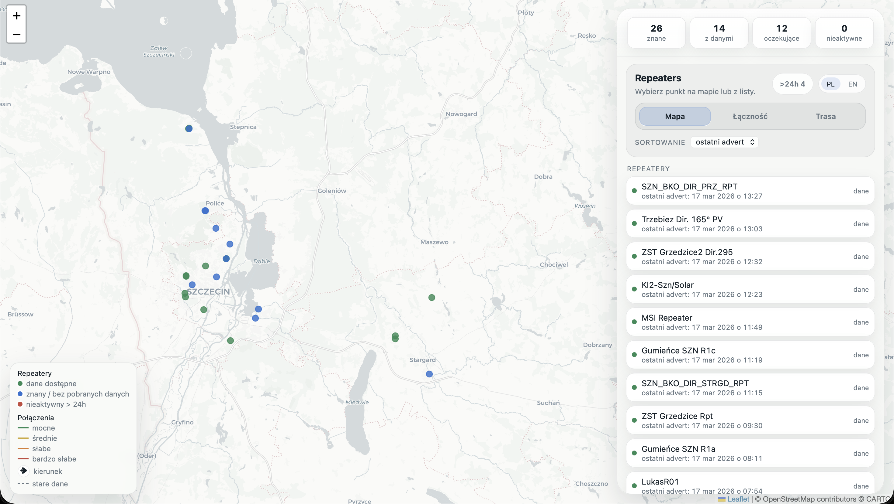
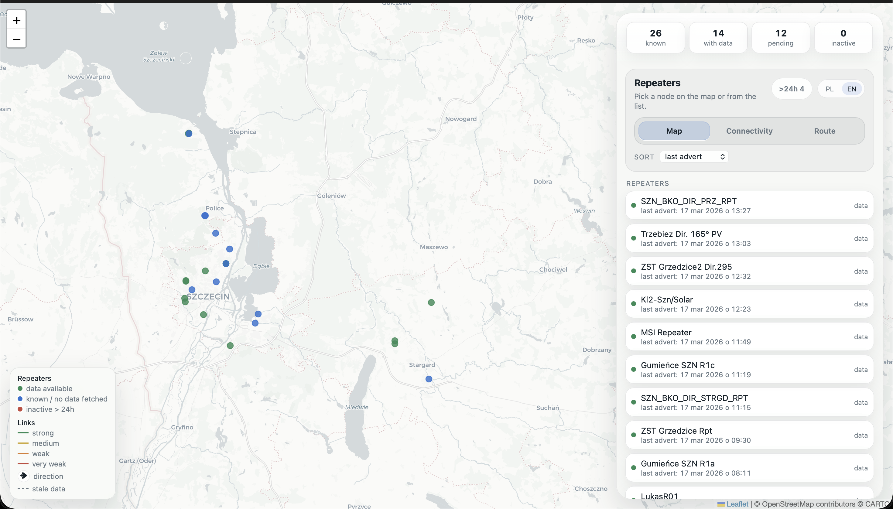
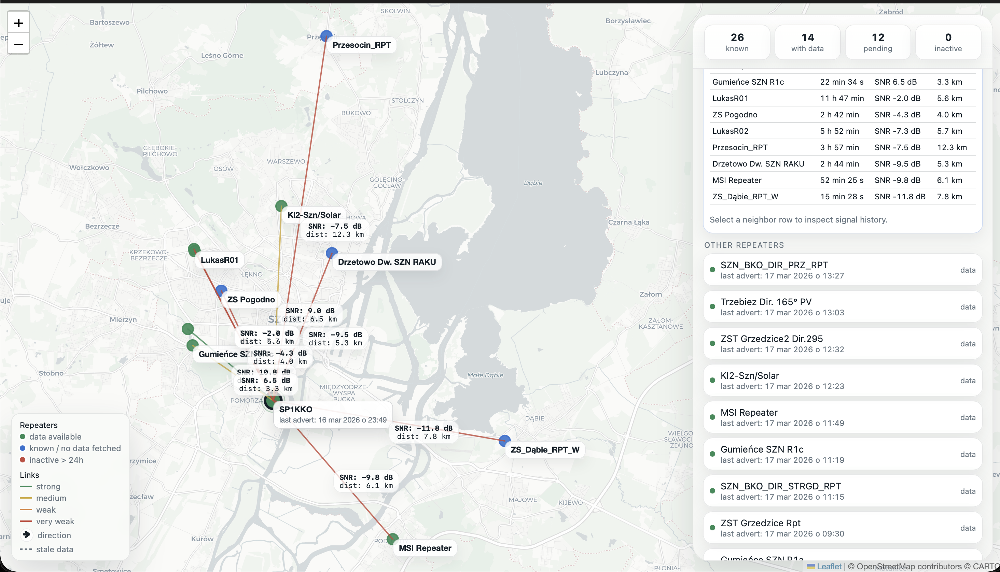
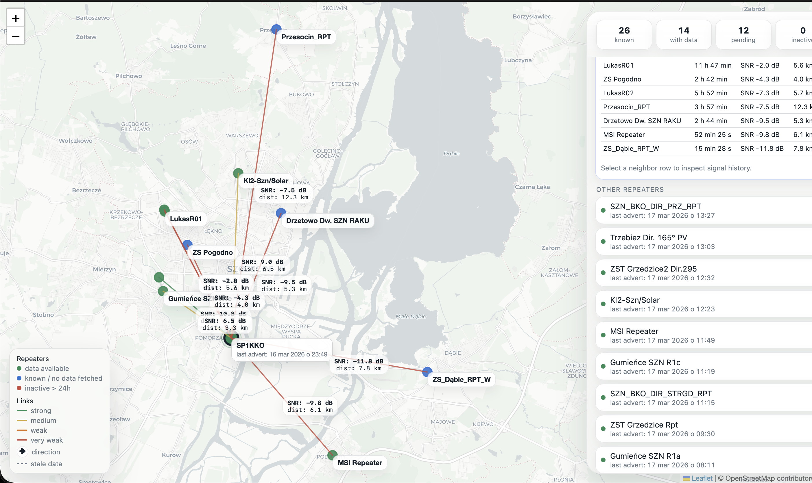
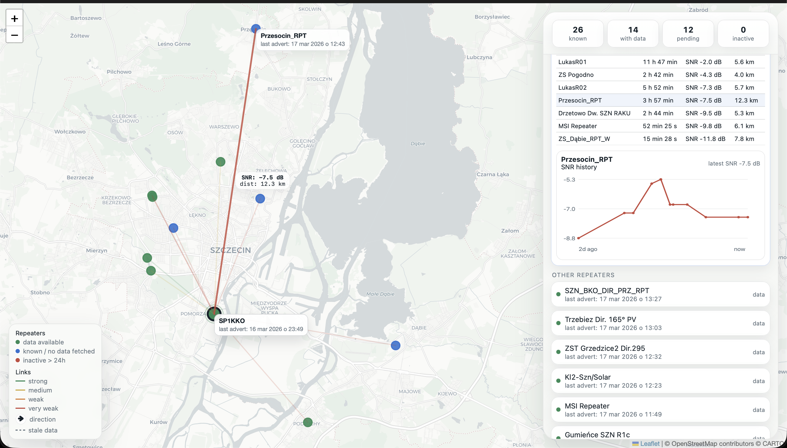
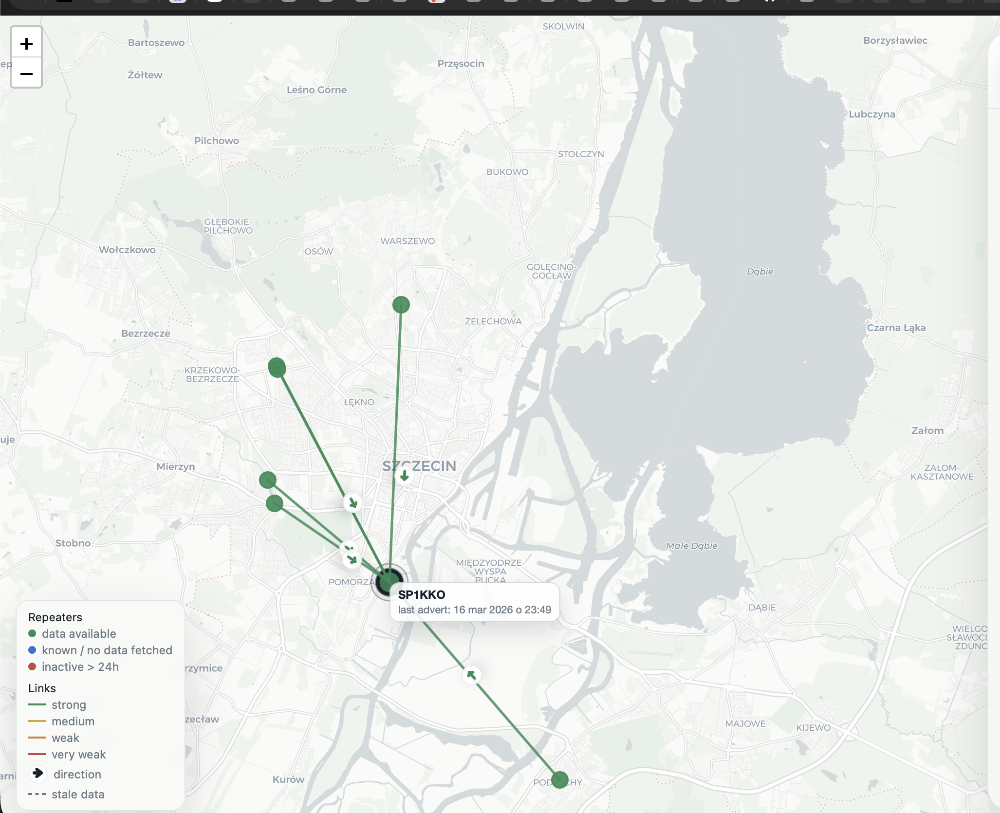
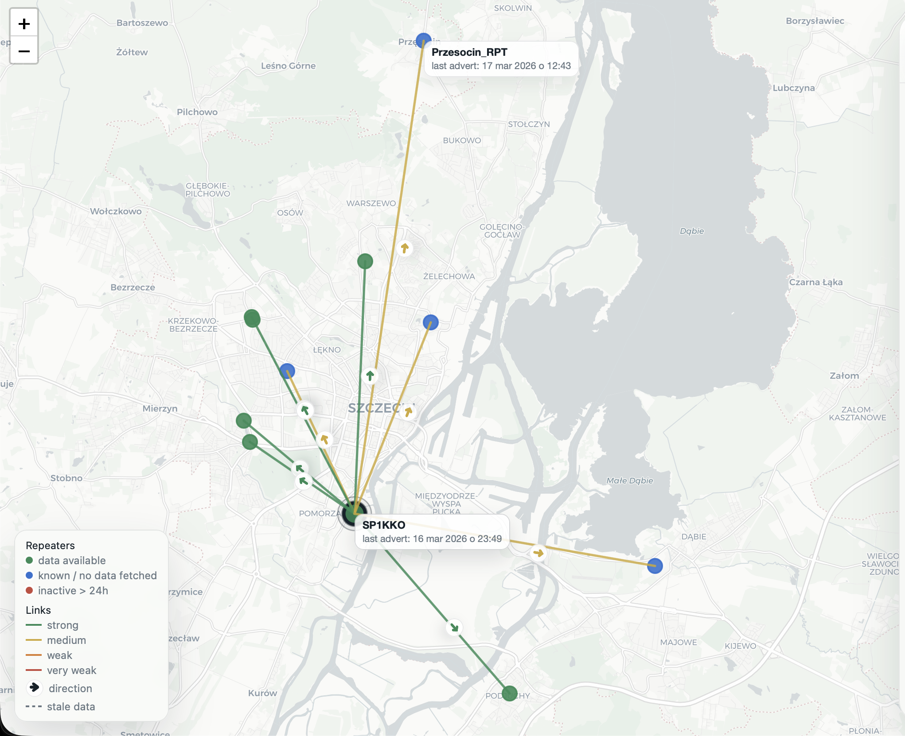
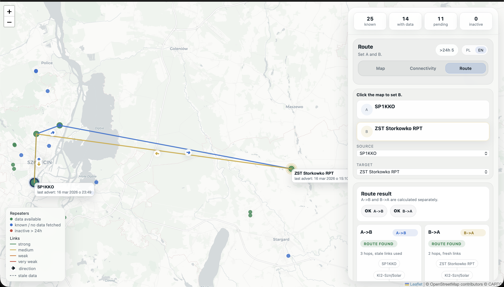

# MeshCore Connectivity Console

MeshCore Connectivity Console is a Docker-first MeshCore operations stack for collecting repeater neighbor data, probing reachable nodes, serving a connectivity dashboard, and running a small channel bot.

The project is built around one hard requirement: it must talk to MeshCore over serial-over-TCP exposed by [meshcore-xiao-wifi-serial2tcp](https://github.com/zm0ra/meshcore-xiao-wifi-serial2tcp). That bridge is not optional in this setup.

## What it does

- connects to an RS232Bridge-compatible TCP endpoint, usually on port `5002`
- ingests MeshCore adverts and stores repeater metadata in SQLite
- logs into reachable repeaters and fetches neighbor snapshots
- builds a directed connectivity graph from the latest known neighbor data
- calculates directional path results for `A->B` and `B->A` separately
- serves a desktop and mobile web UI for map, connectivity, and route analysis
- runs a minimal hashtag-channel bot over the same gateway layer

## Why it is complicated

This is not a thin wrapper around an existing serial client.

The runtime builds MeshCore packets itself, encrypts and MACs payloads itself, wraps them into the RS232 bridge framing itself, and sends those frames over TCP to the serial bridge. It also parses the replies itself.

In practice this means the stack owns the full path below:

1. build MeshCore request or text payloads
2. encrypt and authenticate them using the expected MeshCore wire format
3. wrap them in the RS232 bridge frame format
4. send the frame to the serial-over-TCP bridge
5. decode responses, store snapshots, and derive graph views for the UI

That is why this repository is more involved than a typical dashboard or bot project.

## Must-have dependency

This project requires a repeater or Companion-side setup that exposes the serial interface you want to consume, plus a separate serial-to-TCP bridge in front of it.

The expected bridge implementation is:

- [meshcore-xiao-wifi-serial2tcp](https://github.com/zm0ra/meshcore-xiao-wifi-serial2tcp)

Without that bridge layer, this repository is not enough on its own.

## Architecture

The stack is split into four long-running services plus two one-shot initialization steps:

- `init-db`: initializes the SQLite schema
- `ensure-identity`: creates or loads the local MeshCore identity
- `bridge-gateway`: the only process allowed to hold the TCP connection to the serial bridge
- `neighbours-worker`: ingests adverts, schedules probes, fetches neighbor snapshots, and stores results
- `bot-worker`: listens on configured hashtag channels and replies to a limited command set
- `web`: serves the FastAPI dashboard and `/api/state`

SQLite remains file-based in the shared volume. There is no separate database container.

## Connectivity model

The dashboard works on directed edges.

- `A -> B` means repeater `A` reported that it sees repeater `B`
- missing reverse edge does not imply symmetry
- route search is directional and always computed independently for `A->B` and `B->A`
- the graph represents the latest known neighbor snapshots, not a guaranteed live routing table

The current implementation uses the latest known directed links and shortest-hop BFS for route exploration.

## Desktop and mobile UI

The web UI is designed for both desktop and mobile.

- desktop uses a map-first operator workflow for connectivity and route inspection
- mobile uses a split `Map` / `Analysis` flow instead of a compressed desktop clone
- route results are shown per direction, not as a single symmetric answer
- connectivity views explicitly distinguish outbound, inbound, and mutual visibility

## Documentation

Documentation assets live in `docs/`.

- `docs/README.md` contains the documentation asset layout
- `docs/screenshots/README.md` contains the screenshot naming scheme and suggested captions

## Screenshots

Documentation screenshots live under `docs/screenshots/`.

### Desktop overview



Top-level repeater inventory with the main navigation used for `Map`, `Connectivity`, and `Route` workflows.

### Connectivity inspection



Neighbor inspection on desktop with relation rows, directional link rendering, and operator-focused context in the side panel.



Signal history for a selected relation, shown next to the currently visible connectivity graph.



Outbound-focused desktop map view highlighting what a selected repeater can currently see.



Comparison-oriented connectivity view for distinguishing mutual and one-way relations.

### Mobile flow



Mobile map mode designed for quick directional inspection without compressing the full desktop layout.



Mobile-first connectivity exploration with a simplified map and tap-oriented interaction model.

### Route analysis



Directional route analysis where `A->B` and `B->A` are computed and shown independently.

## Bot scope

The bot is intentionally small and operationally narrow.

- it listens only on hashtag channels from `[bot].channels`
- it supports only commands from `[bot].enabled_commands`
- current supported commands are `!ping`, `!test`, and `!help`
- it does not send self adverts
- it does not handle private messages

## Configuration

- `config/config.example.toml` contains an example runtime configuration
- `docker-compose.example.yml` contains the compose baseline

Most important configuration sections:

- `[endpoints]`: serial-over-TCP targets
- `[gateway]`: Unix sockets shared between containers
- `[probe]`: repeater probe behavior, credentials, retry windows
- `[bot]`: enabled channels, commands, response behavior
- `[web]`: dashboard bind address

Use `python -m meshcore_bot show-config --config config/config.toml` to print the resolved configuration.

Advert-driven probing is intentionally selective.

- stable adverts do not automatically trigger fresh probes anymore
- advert-triggered probing is mainly for first-seen repeaters, recent failures, and meaningful path changes
- `[probe].advert_probe_min_interval_secs` spaces advert-triggered jobs per endpoint to avoid bursts
- `[probe].advert_path_change_cooldown_secs` suppresses route-flap induced reprobe storms

## Local run

```bash
cp config/config.example.toml config/config.toml
cp docker-compose.example.yml docker-compose.yml
docker compose up -d --build
```

Check logs:

```bash
docker compose logs --tail 100 bridge-gateway neighbours-worker bot-worker web
```

Stop everything:

```bash
docker compose down
```

## Technical notes

Relevant implementation areas:

- `meshcore_bot/mesh_builders.py`: builds MeshCore packets and parses encrypted replies
- `meshcore_bot/rs232.py`: encodes and decodes RS232 bridge frames
- `meshcore_bot/bridge_gateway.py`: owns the TCP session and exposes local gateway IPC
- `meshcore_bot/neighbours_worker.py` and `meshcore_bot/probe_service.py`: probing, retries, and snapshot collection
- `meshcore_bot/database.py`: SQLite persistence and web-facing graph queries
- `meshcore_bot/web_service.py`: FastAPI app and the desktop/mobile dashboard

## TCP watchdog

The raw `5002` bridge remains the authoritative transport, but `bridge-gateway` now also reconnects it when the stream stays idle for too long.

- `[gateway].traffic_watchdog_secs` reconnects the raw TCP session after a prolonged lack of traffic
- `[gateway].close_timeout_secs` prevents teardown from hanging forever on a broken socket
- `[[endpoints]].console_mirror_port` optionally probes `5003` before reconnecting and logs whether the verifier channel is still reachable

The `5003` console mirror is only a verifier. It is not treated as the primary mesh packet source.

